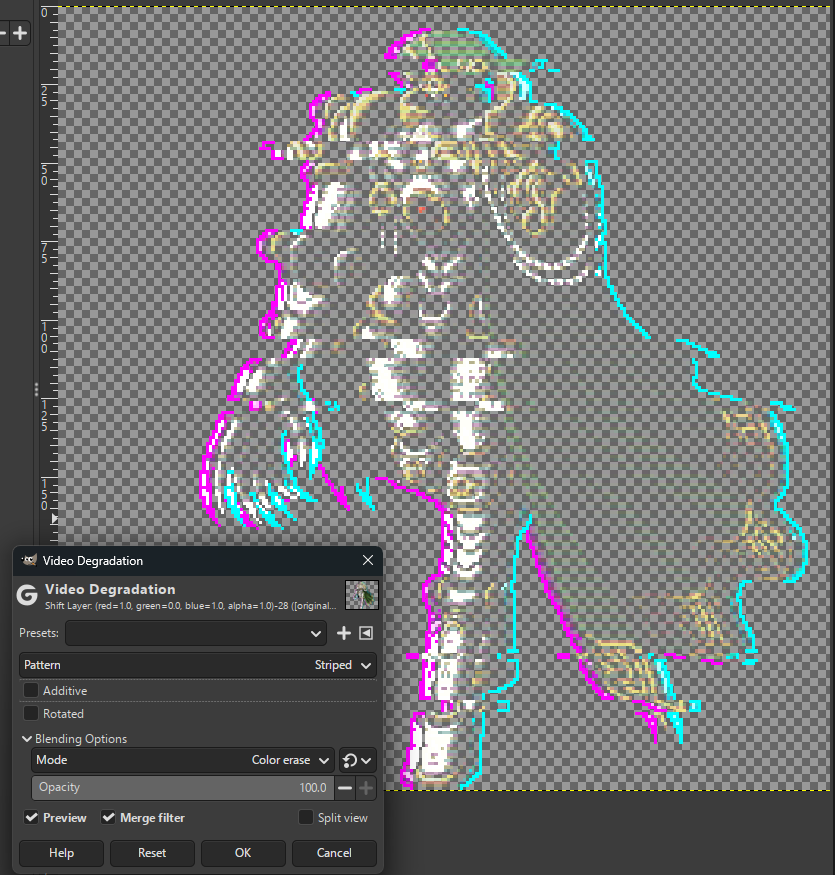

# Glitch Effect

A **GIMP 3** Python plug-in for applying a 'glitch' effect to an image.

**Credits:** Sprites in the examples are from the incredible [Retrograde Minis](https://www.retrogrademinis.com/).

The original script was developed by Tin Tran in 2018, and published on the GimpLearn forums (now down).

## Installation

1. [Download the latest release from the releases page](https://github.com/smangham/gimp_glitch_effect/releases/)
2. Unzip it
3. Put the `ttt-glitch-effect` directory (containing the `ttt-glitch-effect.py` script and `glitch_effect` directory) in your GIMP plug-ins folder.

To find your plug-ins folder, see **Edit > Preferences > Folders > Plug-ins**.
Then, select a folder and click the **Show file location in file manager** button on the right above the list.

You should end up with the directory at a location like:

```sh
C:\Users\YourName\AppData\Local\Programs\GIMP 3\lib\gimp\3.0\plug-ins\ttt-glitch-effect
```

## Usage

A new optionis added under **Colors > Distorts** - *Glitch Effect...* :

| Selecting plug-in | Selecting options | Output |
| --- | --- | --- |
|  |  |  |

The plug-in works on the current image. It creates a merged copy of all the current layers,
selects blocks of the image and 'glitches' them left or right,
then creates colour-shifted copies of the glitch layer and shifts those too.

### Options

#### *Can glitches overlap*

By default, each glitch 'protects' a region equal to its height above and below it.
If this is set, then glitches are allowed to infringe this region or even overlap.

## Suggestions

A neat follow-up is the default distort effect, *Video Degradation*.
The default scanline effect is neat, or alternatively you can use the *color erase* blending mode
to create a more 'ghost' outline.

| Default | Colour erase |
| --- | --- |
|  |  |
